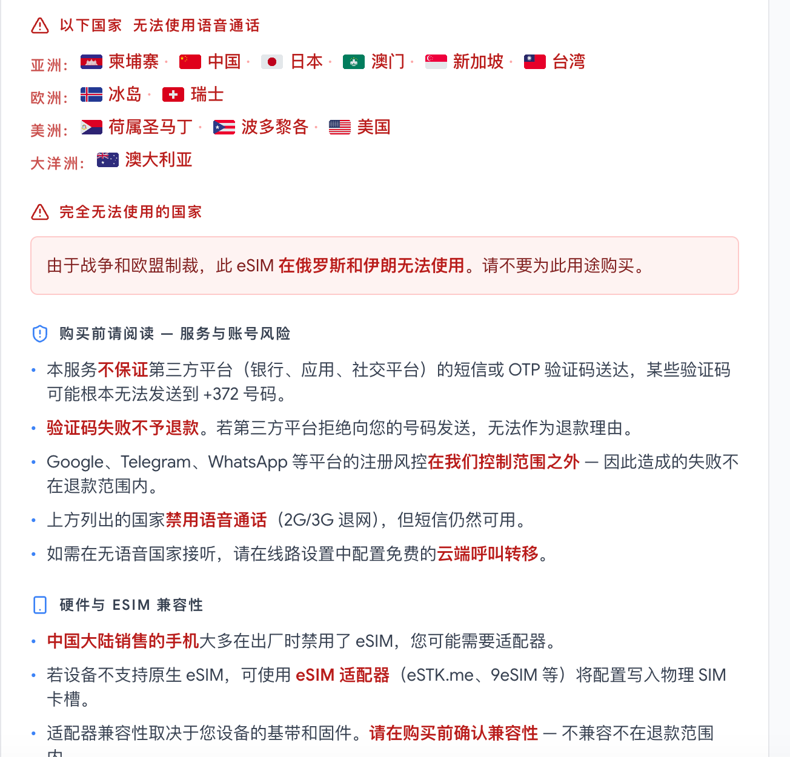
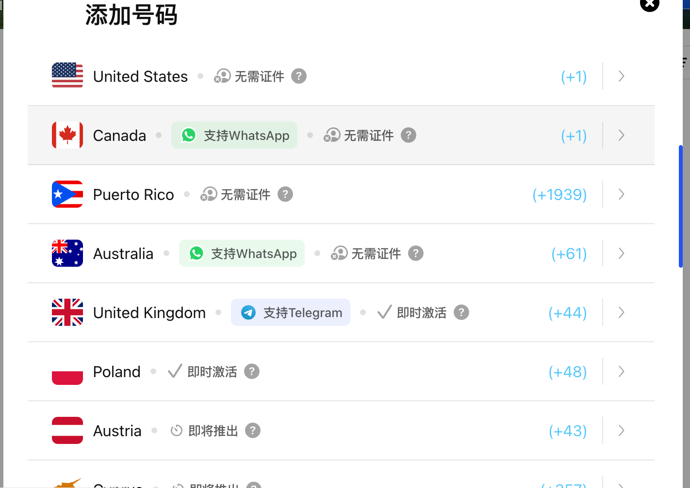

***

title: 推荐几个好用的esim网站
date: 2026-06-01
section: other
summary: 推荐几个好用的esim网站
tags:

- esim
- openai

***

# 推荐几个好用的esim网站

 

 

## **爱沙尼亚**esim 

这个可以申请**爱沙尼亚的esim，可以申请带流量的，网络也是爱沙尼亚的**

> [https://esim.gg ](https://esim.gg/)

可以支持esim适配器, 可以 支付宝 

但是我使用下来有个问题， 没法注册到使用appleid，注册appleid时无法使用，但是注册时不太影响，这里提供一个爱沙尼亚的地址，方便后面使用：

> **示例 1：Tallinn（塔林）公司地址**\
> **姓名：** Jaan Tamm\
> **街道地址：** Tornimäe 7\
> **公寓 / 单元：** (可省略)\
> **邮编：** 10145\
> **城市：** Tallinn\
> **国家：** Estonia\
> **电话：** +372 600 1234
>
> &#x20;
>
> ***
>
> **示例 2：Tartu（塔尔图）酒店地址**\
> **姓名：** Jaan Tamm\
> **街道地址：** Ülikooli 6\
> **公寓 / 单元：** (可省略)\
> **邮编：** 51003\
> **城市：** Tartu\
> **国家：** Estonia\
> **电话：** +372 730 1234

可以通过上面的地址切换appleid在app store的账单地址，很神奇，爱沙尼亚不需要支付方式，只需要设置地址就行了

目前测试下来：

- \[ x ] WhatsApp
- \[ x ] chatgpt/openai/codex

 

## esim plus

这个可以申请虚拟号，也可以申请esim，虚拟号可以用app，也比较方便

> 地址为： <https://esimplus.me/>

可以支付宝/微信

app可以在applestore/google下载
