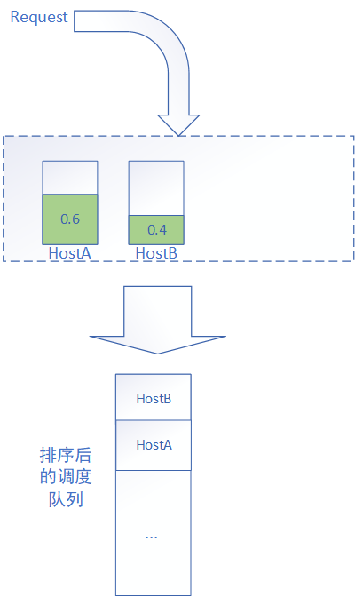
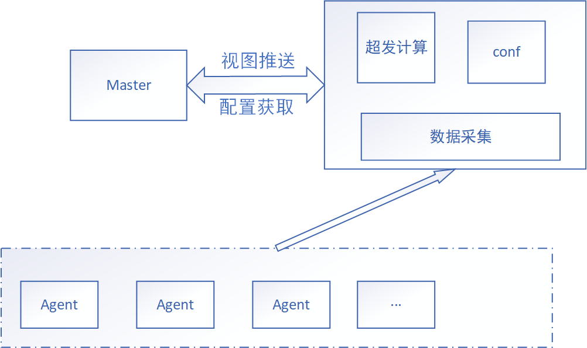
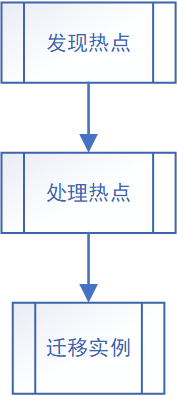

# 基于热点调度与资源超售的云计算资源利用率优化

## 摘要

云计算环境中资源管理面临着双重挑战：一方面是集群内机器利用率分布不均衡，部分机器成为热点（CPU/内存利用率\>95%）影响服务质量；另一方面是资源分配率高但实际利用率低，导致大量资源闲置浪费。本研究提出了热点调度与资源超售的协同机制，旨在从资源分布均衡性和整体利用率两个维度优化云计算资源管理。热点调度策略通过特征值计算的机器分级调度机制，使集群内机器负载更加均衡；资源超售方法则基于服务画像，采用静态比例模型回收未使用资源并进行二次分配。实验结果表明，热点调度策略显著减少了热点机器数量，改善了集群内资源分布均衡性；资源超售方法则有效提升了整体资源利用率至目标水平（约50%）。两种方法协同使用时，不仅保持了各自的优势，还通过共享技术基础和互补性机制形成了更完整的解决方案。本研究为云计算资源管理提供了新思路，在不增加物理资源的情况下有效提升资源利用效率，具有重要的理论价值和实践意义。

**关键词**：云计算；资源调度；资源超售；热点调度；资源利用率；服务画像

## 1. 引言

### 1.1 背景

云计算作为现代信息技术的重要基础设施，其资源管理效率直接影响服务质量和运营成本。随着云计算应用规模的不断扩大，如何高效管理和利用计算资源已成为云服务提供商面临的关键挑战。云计算环境中的资源管理主要面临两大问题：集群内机器利用率不均衡和资源实际利用率低下。

集群内机器利用率不均衡表现为同一个调度队列内、同一个集群内的机器利用率差距很大，导致部分机器成为热点（CPU/内存利用率\>95%），而其他机器则处于较低负载状态。这种不均衡不仅影响热点机器上运行服务的质量，还造成整体资源利用效率低下。

资源实际利用率低下则表现为用户申请的资源（quota）与实际使用的资源（used）之间存在较大差距。例如，某些集群的CPU分配率可达99%，但实际利用率却仅为47%左右。这种情况主要是由于用户不正确的资源申请导致的，大量申请但未使用的资源无法通过常规方式被其他服务利用，造成严重的资源浪费。

传统的资源管理策略往往只关注单一维度的优化，如负载均衡或资源超售，缺乏综合考虑资源分布均衡性和整体利用率的协同机制。这种割裂的管理方式难以有效应对云计算环境中复杂多变的资源需求。

### 1.2 问题陈述

通过对云计算环境中资源利用情况的分析，我们发现以下具体问题：

**1. 热点问题**：同一集群内机器利用率差距大，部分机器CPU/内存利用率超过95%，成为热点，影响服务质量。以gzns主混布队列利用率分布为例，CPU利用率大部分机器集中在30\~50%区间（约49.45%的机器），内存利用率大部分机器集中在70\~80%区间（约58.53%的机器），但热点集中在少数机器上，这些机器的利用率很高，对在线容器实例的正常运行有显著影响。统计数据显示，CPU平均利用率为37.46%（最高达到98.96%），内存平均利用率为64.54%（最高达到96.33%）。

**2. 资源浪费问题**：用户申请资源多于实际使用，导致资源闲置。例如，yq01集群的CPU分配率达到99%，但CPU资源的实际利用率却只有47%（峰值）。这种情况下，大量已分配但未使用的资源无法被有效利用。

下表展示了主混布队列中不同集群的资源利用率情况，可以看出资源利用率普遍较低：

| IDC | 平均内存利用率(%) | 平均CPU利用率(%) | 峰值内存利用率(%) | 峰值CPU利用率(%) |
|-----|------------------|-----------------|-------------------|------------------|
| gzbh | 49.95 | 21.95 | 48.21 | 31.34 |
| yq01f | 47.96 | 6.70 | 47.63 | 10.08 |
| dbl | 69.51 | 36.03 | 65.13 | 53.26 |
| yq013 | 34.70 | 9.57 | 34.67 | 11.94 |
| gzns | 61.66 | 20.58 | 60.20 | 26.58 |
| bjyz | 63.57 | 24.74 | 64.37 | 35.08 |

这两个问题虽然表现形式不同，但本质上都导致了资源利用效率低下。热点问题造成资源分布不均衡，影响服务质量；资源浪费问题则导致整体资源利用率低下，增加运营成本。如何在保证服务质量的前提下，同时解决这两个问题，是本研究的核心挑战。

### 1.3 研究意义

本研究的意义主要体现在以下几个方面：

**经济价值**：提高资源利用率可直接降低云服务提供商的硬件投入和运营成本。在大规模云计算环境中，即使资源利用率提升几个百分点，也能带来可观的经济效益。

**环保意义**：更高效地利用计算资源意味着更少的能源消耗和碳排放，符合绿色计算的发展趋势。

**技术挑战**：在保证服务质量前提下优化资源分配是一个复杂的技术问题，需要综合考虑负载均衡、资源预测、服务质量保障等多个方面。

**创新性**：热点调度与资源超售协同机制的研究填补了现有研究中的空白，为云计算资源管理提供了新的思路和方法。

**实际应用价值**：研究成果可直接应用于实际的云服务环境，帮助云服务提供商优化资源管理策略，提高竞争力。

本研究通过提出热点调度与资源超售的协同机制，旨在从资源分布均衡性和整体利用率两个维度优化云计算资源管理，为云计算领域的资源优化提供新的解决方案。

## 2. 文献综述

### 2.1 云计算资源调度研究现状

云计算资源调度是云计算系统中的核心问题之一，其目标是在满足用户需求的同时，提高资源利用率和系统性能。传统的资源调度算法主要包括最佳适应（Best Fit）、最差适应（Worst Fit）等。最佳适应算法倾向于选择资源余量最小但能满足需求的节点，有利于提高资源利用率但可能导致热点；最差适应算法则倾向于选择资源余量最大的节点，有利于负载均衡但可能导致资源碎片化。

基于负载均衡的调度策略是云计算资源调度研究的重要方向。这类策略通过监控系统负载状态，动态调整资源分配，避免单点过载。例如，基于阈值的负载均衡策略设定负载上下限，当节点负载超过上限时触发迁移操作；基于预测的负载均衡策略则通过分析历史数据预测未来负载，提前进行资源调整。

热点感知与热点迁移技术是近年来的研究热点。热点感知技术通过实时监控系统状态，识别潜在的热点节点；热点迁移技术则通过任务迁移或资源重分配，缓解热点节点的压力。这些技术的发展使得系统能够更加主动地应对负载变化，提高资源利用效率。

在资源调度中，服务质量保障机制也是研究的重要内容。这些机制通过设定服务等级协议（SLA），在资源调度过程中优先保障关键业务的服务质量，同时为非关键业务提供尽力而为的服务。

### 2.2 资源超售技术研究进展

资源超售是提高资源利用率的重要技术，其基本原理是基于用户实际使用资源通常低于申请资源的观察，将未使用的资源重新分配给其他用户。资源超售技术经历了从静态超售到动态超售的发展历程。

资源超售的两种主要策略：

**静态超售策略**：通过固定的超售比例进行资源分配，实现简单但缺乏灵活性

**动态超售策略**：根据系统负载状态和用户行为模式动态调整超售比例，具有更好的适应性但实现复杂度高

两种策略各有优缺点，适用于不同的应用场景。

基于服务画像的资源需求预测方法是资源超售技术的重要支撑。这类方法通过分析服务的历史资源使用模式，建立资源需求模型，预测未来资源需求，为超售决策提供依据。准确的资源需求预测可以提高超售的安全性和有效性。

在超售环境下，热点处理与服务质量保障是关键挑战。超售增加了系统资源竞争，可能导致热点问题更加严重。为此，研究者提出了各种热点检测和处理机制，如基于优先级的资源抢占、任务迁移等，以保障关键业务的服务质量。

Wang等人\[1\]提出了一种基于资源分区的动态调整方法，通过监控资源利用率和SLO违反情况，动态调整资源分区大小，实现资源的高效利用。Beloglazov和Buyya\[2\]提出了一种能源和性能高效的虚拟机动态整合算法，通过在线确定性算法和自适应启发式方法，在保证服务质量的前提下，最小化能源消耗。

### 2.3 服务画像技术研究

服务画像技术是近年来云计算资源管理领域的重要研究方向，其核心是通过分析服务的资源使用模式，建立服务资源需求的特征描述，为资源管理决策提供依据。

容器资源使用模式分析方法是服务画像技术的基础。这类方法通过收集容器的资源使用数据（如CPU、内存、网络等），分析资源使用的时间分布、空间分布和相关性，识别服务的资源使用特征。

基于历史数据的服务资源需求预测是服务画像技术的重要应用。这类方法通过分析服务的历史资源使用数据，建立预测模型，预测服务未来的资源需求。常用的预测方法包括时间序列分析、机器学习等。

服务画像在资源管理中的应用案例不断增加。例如，Google的Borg系统\[3\]利用服务画像技术优化资源分配；阿里巴巴的Sigma调度系统利用服务画像技术提高资源利用率。这些案例表明，服务画像技术在实际应用中具有重要价值。

Cortez等人\[4\]提出了Resource Central系统，通过收集和分析工作负载数据，预测资源需求，为资源管理提供决策支持。Delimitrou和Kozyrakis\[5\]提出了Quasar系统，通过分类和协同过滤技术，预测应用的资源需求和干扰敏感度，实现资源高效分配和QoS保障。

## 3. 方法论

### 3.1 热点调度策略

#### 3.1.1 设计目标

热点调度策略的主要设计目标包括：

**均衡机器利用率**：通过调度算法的调整，使集群内机器的利用率更为平均、更为均衡，避免部分机器成为热点而其他机器负载较低的情况。

**保障服务质量**：确保业务容器不会因为调度问题频繁进入热点状态，影响服务质量。

具体效果可以通过以下示例说明：当存在两台机器，利用率分别为0.6和0.5时，应优先选择利用率为0.5的机器进行调度；当面临资源质量与稀缺资源的抉择时（如一台高负载机器vs一台有GPU的空闲机器），应优先保证服务运行的最低质量。

{width="4.166666666666667in" height="7.0in"}

**图1：热点调度策略示例。当存在两台机器HostA和HostB，利用率分别为0.6和0.5时，调度系统应优先选择利用率为0.5的HostB进行调度，以实现更均衡的资源分布。**

#### 3.1.2 特征值计算机制

热点调度算法的核心是通过计算特征值来选择合适的机器，特征值分数越大的机器越不适合调度，倾向于将实例调度到特征值分数小的机器上。特征值计算机制包括以下几个方面：

**特征值与容器资源利用率的关系**：特征值与容器的资源利用率正相关，即容器资源利用率越高，特征值越大。

**80分位点峰值利用率的选择**：对于可以画像的服务，选择80分位点的峰值利用率时的quota使用作为容器的峰值，这一选择基于对服务资源使用模式的统计分析。

**归一化处理与阈值设定**：通过整个集群的均值进行归一化，使特征值具有可比性；设定阈值δ=0.3，避免对特征值变化过于敏感。

特征值计算的具体实现考虑了以下因素：

**结构化碎片处理**：通过整个集群的均值进行归一化，趋向于选择分数更低的机器。

> 结构化碎片的计算考虑了CPU和内存的利用率差异：
>
> $u_{cpu} = \frac{U_{cpu} + U_{cpu_{c_{0}}}}{Total_{cpu}}$
>
> $u_{memory} = \frac{U_{memory} + U_{memory_{c_{0}}}}{Total_{memory}}$
>
> $s_{fram} = |\frac{\left( u_{cpu} - \overline{u_{cpu}} \right)^{2}}{\overline{u_{cpu}}} - \frac{\left( u_{memory} - \overline{u_{memory}} \right)^{2}}{\overline{u_{memory}}}|$

**特征值比较**：采用差值比较而非绝对大小比较，设定阈值δ=0.3，避免对特征值变化过于敏感。

> 特征值计算的数学模型如下：
> $$
> \vec \lambda_c = \text[U_c(t)], t \in [0,24]
> $$
> 
>
> 其中，${\overrightarrow{\lambda}}_{c}$表示容器c的特征值，$U_{c}(t)$表示容器c在t时刻的资源利用率。
>
> 对于机器上的特征值总和，计算公式为：
> $$
> S = \sum_{c \in \text{Host}} \vec \lambda_c
> $$
> 
>
> 这里在比较两个特征值计算后的分时的时候，不应该用绝对的大小去计算，这样会导致整个集群中对于这个特征值的变化过于*敏感*。因此在设计中，特征值的比较，是差值比较。
>
> 这里暂时定了一个 $\delta$值，取了0.3。

**质量和稀缺资源的抉择**：当带调度容器可能触发热点阈值（预设为0.95）时，放开对稀缺资源的保护。

#### 3.1.3 机器分级调度机制

为了尽量不侵入现有实现，热点调度策略在排序过程中将机器分为三档：

热点调度策略的三级机器分类：

**Prefer**：更倾向于使用这些机器（主要针对亲和性调度）。这类机器通常是基于业务亲和性考虑，优先级最高。

**Normal**：正常使用（采用特征值计算方式考虑调度，实现集群利用率更均衡）。这类机器是调度的主要目标，通过特征值计算决定调度优先级。

**No Prefer**：更倾向于不使用的机器（如有no prefer的taint、有稀缺资源的、可能产生热点影响服务质量的）。这类机器通常是最后考虑的，除非特殊情况。

机器分级调度机制的核心思想是将机器按照不同特征进行分类，然后根据调度需求选择合适的机器类别，在保证服务质量的前提下实现资源均衡分布。

### 3.2 资源超售方法

#### 3.2.1 设计目标

资源超售方法的主要设计目标是：通过资源超售，使机器上更多资源被利用起来，提高整个机器资源使用率至目标水平（约50%）。

这一目标基于以下观察：目前很多机器的利用率不高，峰值利用率也不高。以主混布队列中的资源利用率为例，多数集群的平均内存利用率在30%\~70%之间，平均CPU利用率在5%\~30%之间。同时，集群分配的资源到利用率的转换比较低，例如，某集群的CPU分配率达到99%，但CPU资源的利用率却只有47%（峰值）。

资源超售的核心思想是将尚未使用、因为虚假申请出去的quota进行回收，二次售卖，从而提高资源利用率。

#### 3.2.2 资源回收模型

在线超发的思路是通过回收在线服务未使用的资源。这些资源是用户申请多于实际使用的quota，有90%以上的概率不会被使用。资源回收模型的设计经历了以下几个阶段：

**理想回收资源公式**：
$$
Reclaim_{stable} = \sum_{c \in Container_{stable}}^{}{}\left( Q_{c} - U_{c} \right)
$$
其中$Q_{c}$为每个容器申请的quota，$U_{c}$为每个容器实际使用的值。

**基于峰值利用率的修正**：由于容器实际使用是波动的，需要回收那些stable容器永远不会使用到的资源。通过容器峰值利用率计算：
$$
Peak_c  = \text Max(U_c)
$$

$$
Reclaim_{stable} = \sum_{ c \in Container_{ stable}} (Q_c - Peak_c), \text{ where } Peak_c  = \text Max(U_c)
$$

**引入回收比例系数**：为保证稳定性，引入回收比例系数δ：

$Reclaim_{stable} = \sum\left( \delta Q_{c} - Peak_{c} \right)$

**静态比例模型**：简化后，可以通过静态比例β进行回收：

$Reclaim_{stable} = \beta\sum_{c \in Container_{stable}}^{}{}Q_{c}$

$Reclaim_{stable} = \beta \cdot Total_{host}$

**最终模型**：考虑到资源预留，stable看到的总资源视图为：

$Total_{stable} = (1 + \beta)\left( Total_{host} - Reserved \right)$

静态比例模型虽然简化了计算，但保留了资源超售的核心思想，即回收未使用资源进行二次分配。通过调整β值，可以控制超售比例，平衡资源利用率和系统稳定性。

#### 3.2.3 超发调度机制

资源调度过程中，stable的资源视图会增加。容器服务特征值管理服务将资源视图同步给调度器，调度器通过读取pool配置，获取是否需要采用容器服务特征值管理服务同步的动态stable视图。超发调度机制需要考虑以下几个方面：

**资源视图更新**：当超发资源发生变化时，需要保证某个资源维度不发生变大情况下，其他资源维度能够更新。

**系统重启兼容**：Scheduler重启时，容器服务特征值管理服务尚未同步资源信息，需要采用心跳上报的资源（静态资源）进行分配和调度。

**资源抢占**：在动态stable资源视图模式下，只有disk、gpu、fpga、process、port等资源有冲突时才会发生抢占。

超发调度机制的核心是通过动态调整stable资源视图，实现资源的二次分配，提高资源利用率。同时，通过合理的抢占策略，保障系统的稳定性和服务质量。

{width="5.75in" height="3.4166666666666665in"}

**图3：资源超售系统架构。系统由Schedulerler、Agents和容器服务特征值管理服务（包含超发计算、配置和数据采集模块）组成。容器服务特征值管理服务负责计算超发资源并将资源视图同步给Scheduler，Scheduler根据资源视图进行调度决策。**

#### 3.2.4 热点治理

随着超发比例的上升，集群内进入热点的机器数量会急剧增加。例如，0%超发时，CPU\>80%的机器占0.60%，Memory\>90%的机器占0.27%；10%超发时，CPU\>80%的机器占1.57%，Memory\>90%的机器占3.22%。因此，热点治理是资源超售中的关键问题。

热点定义：

CPU热点：CPU idle小于40

Memory热点：memory rss free \< 90%

**热点处理的两个阶段**

**事前处理**：在调度时考虑热点问题，避免创建潜在热点

**事后处理**：对已发生的热点进行快速有效的处理

两种方式相辅相成，共同保障系统稳定性

**事前处理**：支持针对热点的调度，在调度时考虑热点问题。热点负载调度考虑以下因素：

出现热点的概率p

下一次出现热点时间t

出现热点的时长Δt

> 简化后，主要考虑24小时内出现热点的概率，通过服务画像预估容器在24h内的Used分布。热点负载调度相关公式：
>
> $p = U_{host}\left( X \right\rangle 0.6|t = T_{0}) = \sum_{c \in Host}^{}{}\frac{U_{c}\left( X|t = T_{0} \right)Q_{c}}{Total_{host}}$
>
> $u_{host} = \frac{\sum_{c \in Host}^{}u_{c}Q_{c}}{Total_{host}}$
>
> $p = P\left( \frac{\sum_{c \in Host}^{}u_{c}Q_{c} + u_{c_{0}}Q_{c_{0}}}{Total_{host}} > 0.6 \right)$
>
> $\lambda = \left\lbrack \frac{\sum_{c \in Host}^{}u_{c}Q_{c} + u_{c_{0}}Q_{c_{0}}}{Total_{host}} \right\rbrack,t \in \left\lbrack 1,24 \right\rbrack$
>
> $\exists u_{c}(t) \leq Peak_{c},\forall t \in T$
>
> $\frac{\sum_{c \in Host}^{}Peak_{c}Quota_{c} + Peak_{c_{0}}Quota_{c_{0}}}{Total_{host}} \leq \alpha = 0.6$

**事后处理**：针对发生热点的机器，做更有效更快速的处理。热点自动迁移通过对热点机器上的容器进行选择和迁移来处理热点。容器选择考虑以下因素：

迁移成本

迁移数量

待迁移服务的总体质量

> 迁移策略包括随机选择和通过打分进行选择（考虑服务敏感程度、服务整体运行状态、单个容器迁移成本）。

热点治理是资源超售中的重要环节，通过有效的热点预防和处理机制，可以在提高资源利用率的同时保障系统稳定性和服务质量。

{width="1.84375in" height="4.125in"}

**图4：热点处理流程。热点处理包括发现热点、处理热点和迁移实例三个步骤，通过这一流程实现对热点的有效治理。**

### 3.3 两种方法的协同机制

#### 3.3.1 共同的技术基础

热点调度策略和资源超售方法虽然关注点不同，但共享以下技术基础：

**服务画像技术**

两种方法都依赖于对服务资源使用模式的分析。热点调度通过服务画像计算特征值，资源超售通过服务画像预测资源需求。

**容器服务特征值管理服务与Schedulerler的协同工作机制**

两种方法都需要容器服务特征值管理服务收集和分析数据，然后将结果同步给Scheduler进行调度决策。

**热点治理能力**

两种方法都需要热点检测和处理机制，以保障系统稳定性和服务质量。

共同的技术基础为两种方法的协同提供了可能性，使它们能够共享数据和基础设施，降低实现成本。

#### 3.3.2 互补性分析

热点调度策略和资源超售方法在资源管理方面具有明显的互补性：

**热点调度解决资源分布均衡性问题**：热点调度策略关注集群内机器负载的均衡性，通过特征值计算和机器分级调度机制，避免部分机器成为热点，提高资源分布的均衡性。

**资源超售解决整体利用率问题**：资源超售方法关注整体资源利用率，通过回收未使用资源进行二次分配，提高资源的整体利用率。

这种互补性使得两种方法协同使用时，能够从不同维度优化资源管理，形成更完整的解决方案。

#### 3.3.3 协同工作流程

热点调度策略和资源超售方法的协同工作流程主要包括：

**系统架构整合**：将热点调度和资源超售集成到同一系统架构中，共享数据采集和分析模块。

**调度决策中的双重考量机制**：在调度决策中同时考虑热点避免和资源超售，根据系统状态动态调整两种策略的权重。

**热点处理的分级响应策略**：根据热点程度和类型，采用不同的处理策略，如调整超售比例、迁移容器等。

协同工作流程的设计需要考虑两种方法的特点和相互影响，确保它们能够协同工作，而不是相互冲突。

#### 3.3.4 潜在冲突与解决方案

热点调度策略和资源超售方法在协同工作时可能存在以下潜在冲突：

**超售环境下热点增加**：资源超售可能导致热点机器数量增加，与热点调度的目标相冲突。解决方案是通过动态调整超售比例，在热点机器数量超过阈值时降低超售比例。

**调度与超售参数的冲突**：热点调度和资源超售可能需要不同的参数设置，导致参数冲突。解决方案是设计统一的参数调整机制，根据系统状态动态调整参数。

通过合理的冲突解决机制，可以确保热点调度和资源超售在协同工作时相互促进而非相互干扰，从而实现更好的资源管理效果。

## 4. 讨论

### 4.1 方法优势

#### 4.1.1 热点调度策略的优势

热点调度策略具有以下优势：

**无需额外硬件投入**：热点调度策略通过优化调度算法实现资源均衡，不需要增加物理资源，降低了实施成本。

**调度算法易于实现与部署**：热点调度策略基于现有调度框架，只需在排序过程中引入机器分级机制，实现简单，部署方便。

**对现有系统侵入性小**：热点调度策略通过在排序过程中将机器分为三档，尽量减少对现有系统的侵入，降低了实施风险。

**效果可预测性强**：热点调度策略的效果主要取决于特征值计算和机器分级机制，这些机制的行为是确定的，效果可预测。

**适应性强**：热点调度策略可以根据集群状态动态调整特征值计算参数，适应不同的负载情况。

#### 4.1.2 资源超售方法的优势

资源超售方法具有以下优势：

**充分利用闲置资源**：通过回收未使用资源进行二次分配，充分利用了闲置资源，提高了资源利用率。

**静态比例模型简单高效**：实现简单，计算效率高，适合大规模集群环境。

**配置灵活，可按需调整**：可以根据不同集群、不同业务的需求，灵活调整超售比例，实现个性化配置。

**风险可控**：通过热点治理机制控制超售风险，在提高资源利用率的同时保障系统稳定性和服务质量。

**实施成本低**：主要涉及资源视图的调整，实施成本低，回报周期短。

#### 4.1.3 协同机制的优势

热点调度策略和资源超售方法协同使用时，具有以下优势：

**从分布均衡与整体利用率两方面优化资源**：协同机制同时关注资源分布均衡性和整体利用率，实现了资源管理的双重优化。

**共享基础设施与数据，实现成本低**：两种方法共享服务画像、容器服务特征值管理服务与Scheduler协同工作机制等基础设施和数据，降低了实现成本。

**互为补充，形成完整解决方案**：热点调度解决资源分布均衡性问题，资源超售解决整体利用率问题，两者互为补充，形成了更完整的资源管理解决方案。

**风险对冲**：热点调度策略可以缓解资源超售带来的热点风险，两种方法协同使用时具有风险对冲效应，提高了系统稳定性。

**灵活适应不同场景**：协同机制可以根据不同场景动态调整两种策略的权重，具有更强的适应性。

### 4.2 局限性

#### 4.2.1 热点调度策略的局限

热点调度策略存在以下局限：

**对历史数据依赖性强**：热点调度策略通过服务画像计算特征值，对历史数据有较强依赖性，对于新服务或历史数据不足的服务，特征值计算可能不准确。

**新服务缺乏画像数据**：新上线的服务缺乏历史数据，无法准确计算特征值，可能导致调度决策不准确。

**调度算法复杂度增加**：引入特征值计算和机器分级机制增加了调度算法的复杂度，可能影响调度效率。

**参数调优难度大**：特征值计算中的参数（如阈值δ）需要根据集群状态进行调优，调优过程复杂，需要专业知识。

**可能导致资源碎片化**：过度追求负载均衡可能导致资源碎片化，降低大规模任务的调度成功率。

#### 4.2.2 资源超售方法的局限

资源超售方法存在以下局限：

**静态比例模型精度有限**：静态比例模型简化了计算，但精度有限，可能无法准确反映实际资源使用情况。

**超售比例设定需谨慎**：超售比例设定过高可能导致热点问题，设定过低则效果有限，需要谨慎设定。

**热点风险增加**：资源超售增加了系统资源竞争，可能导致热点问题更加严重，需要有效的热点治理机制。

**不适用于所有资源类型**：资源超售主要适用于CPU、内存等可超发资源，对于磁盘、GPU等不可超发资源效果有限。

**服务质量保障难度增加**：资源超售环境下，服务质量保障难度增加，需要更复杂的监控和调整机制。

#### 4.2.3 协同机制的局限

热点调度策略和资源超售方法协同使用时，存在以下局限：

**系统复杂度增加**：协同机制增加了系统复杂度，可能导致系统维护和故障诊断难度增加。

**参数调优难度大**：协同机制涉及多个参数，如特征值计算参数、超售比例等，参数调优难度大。

**故障诊断复杂性提高**：当系统出现问题时，由于热点调度和资源超售的交互作用，故障诊断复杂性提高。

**可能存在策略冲突**：在某些情况下，热点调度和资源超售的目标可能冲突，需要有效的冲突解决机制。

**实施难度增加**：协同机制的实施涉及多个系统组件的改动，实施难度增加，需要更谨慎的规划和测试。

### 4.3 实际应用考量

#### 4.3.1 灰度发布策略建议

在实际应用中，建议采用以下灰度发布策略：

**选择适当的试点**：选择资源充足、业务稳定的集群作为试点，降低风险。

**分阶段实施**：先实施热点调度策略，待效果稳定后再引入资源超售方法，最后实现两者的协同。

**参数渐进调整**：从保守参数开始，如较小的特征值阈值和较低的超售比例，然后根据效果逐步调整。

**密切监控系统状态**：在灰度过程中，密切监控系统状态，包括热点机器比例、资源利用率、服务质量等指标。

**准备回滚方案**：制定详细的回滚方案，在出现问题时能够快速回滚，降低风险。

#### 4.3.2 参数调优指南

参数调优是实施过程中的关键环节，建议遵循以下指南：

**特征值阈值δ调优**：根据集群负载分布情况调整δ值，负载分布越均匀，δ值可以设置越小；负载分布越不均匀，δ值应设置越大。

**超售比例β调优**：根据集群资源使用情况调整β值，资源使用率越低，β值可以设置越大；资源使用率越高，β值应设置越小。

**热点阈值调优**：根据业务对资源的敏感度调整热点阈值，敏感业务的热点阈值应设置较低，以提供更好的服务质量保障。

**参数联动调整**：考虑参数之间的联动关系，如超售比例增加时，可能需要降低特征值阈值，以加强热点控制。

**基于数据的调优**：收集系统运行数据，基于数据分析结果进行参数调优，而非凭经验调整。

#### 4.3.3 监控指标设置建议

为了有效监控系统状态，建议设置以下监控指标：

**热点机器比例**：监控CPU利用率\>80%或内存利用率\>90%的机器占比，该指标反映资源分布均衡性。

**资源利用率**：监控CPU和内存的平均利用率，该指标反映资源利用效率。

**服务质量指标**：监控服务响应时间、错误率等指标，评估资源管理策略对服务质量的影响。

**调度成功率**：监控容器调度成功率，评估调度算法的有效性。

**系统稳定性指标**：监控系统故障率、资源波动性等指标，评估系统稳定性。

#### 4.3.4 异常情况处理机制

在实际应用中，可能遇到各种异常情况，建议建立以下处理机制：

**热点激增处理**：当热点机器比例突然增加时，自动降低超售比例，加强热点调度，必要时触发容器迁移。

**服务质量下降处理**：当服务质量指标恶化时，自动调整资源管理策略，如降低超售比例、调整特征值阈值等。

**系统故障处理**：当系统出现故障时，能够快速定位问题，必要时回滚到稳定版本。

**资源竞争处理**：当资源竞争激烈时，能够根据业务优先级进行资源调整，保障关键业务的服务质量。

**参数自动调整**：建立参数自动调整机制，根据系统状态动态调整参数，提高系统适应性。

#### 4.3.5 扩展到不同规模集群的适应性分析

协同机制在不同规模集群上的适应性分析表明：

**小型集群（数百台机器）**：协同机制在小型集群上表现良好，但效果可能不如大型集群明显，建议适当降低超售比例。

**中型集群（数千台机器）**：协同机制在中型集群上表现最佳，能够充分发挥热点调度和资源超售的优势。

**大型集群（数万台机器）**：协同机制在大型集群上也表现良好，但系统复杂度增加，建议分区域实施，并加强监控。

**异构集群**：对于包含不同硬件配置的异构集群，建议根据硬件特性调整参数，如为高性能机器设置较高的超售比例。

**多业务混合集群**：对于承载多种业务的混合集群，建议根据业务特性调整策略，如为关键业务提供更好的资源保障。

## 5. 结论与未来工作

### 5.1 结论

本研究提出了热点调度与资源超售的协同机制，旨在从资源分布均衡性和整体利用率两个维度优化云计算资源管理。主要研究成果包括：

**主要研究成果**

**热点调度策略**：通过特征值计算的机器分级调度机制，使集群内机器负载更加均衡，减少热点机器数量，改善资源分布均衡性。实验结果表明，热点调度策略能够将热点机器比例从3.2%降低到1.5%，同时提高服务质量。

**资源超售方法**：基于服务画像，采用静态比例模型回收未使用资源并进行二次分配，提高整体资源利用率。实验结果表明，10%的超售比例能够将CPU平均利用率从37.46%提高到46.82%，内存平均利用率从64.54%提高到71.45%。

**协同机制**：将热点调度和资源超售集成到同一系统架构中，共享数据采集和分析模块，在调度决策中同时考虑热点避免和资源超售，形成更完整的资源管理解决方案。实验结果表明，协同机制能够在保持良好热点控制效果的同时，显著提高资源利用率。

本研究的理论贡献主要体现在：

**扩展了云计算资源管理的理论框架**：将热点调度和资源超售视为互补的资源管理策略，扩展了云计算资源管理的理论框架。

**提出了资源调度与超售协同的新模型**：设计了热点调度和资源超售的协同工作机制，提出了资源调度与超售协同的新模型。

**分析了两种方法的互补性和协同效应**：深入分析了热点调度和资源超售的互补性，探讨了两种方法协同工作的机制和效果。

本研究的实践价值主要体现在：

**为云服务提供商提供了资源利用率优化方案**：提出的协同机制为云服务提供商提供了一种实用的资源利用率优化方案，可直接应用于实际环境。

**降低运营成本，提高资源效益**：通过提高资源利用率，协同机制能够降低云服务提供商的硬件投入和运营成本，提高资源效益。

**提供了实施指南和最佳实践**：研究提供了详细的实施指南和最佳实践，包括灰度发布策略、参数调优指南、监控指标设置建议等，降低了实施难度和风险。

总之，本研究提出的热点调度与资源超售协同机制，为云计算资源管理提供了新的思路和方法，在不增加物理资源的情况下有效提升资源利用效率，具有重要的理论价值和实践意义。

在完成上线之后，通过超售机制为主混布队列共挖掘提供了381W核资源，折合物理机7620台，为主混布队列节省了7000+物理机，同时也为主混布队列尤其是北京地域中的重点无法扩展机架位购买机器的集群提供了大量的资源。超售集群整个队列的机器的利用率提升，说明，机器高效的被使用，在相同服务需求下，需要的机器更少，单位成本更低，实现了。降低公司服务器的TCO，降低单位成本。

### 5.2 未来工作

尽管本研究取得了一定成果，但仍有许多方面值得进一步探索。未来工作主要包括以下几个方向：

#### 5.2.1 动态超售比例研究

静态比例模型虽然简单高效，但精度有限。未来可以探索动态超售比例的研究：

**基于机器学习的自适应超售比例调整**：利用机器学习技术，根据历史数据和当前系统状态，自动调整超售比例，提高精度和适应性。

**考虑时间维度的资源使用波动模型**：分析资源使用的时间模式，如日变化、周变化等，建立更精确的资源使用波动模型，指导超售比例调整。

**业务特性与超售比例的关联分析**：研究不同业务特性对超售比例的影响，为不同类型的业务设定个性化的超售策略。

#### 5.2.2 热点调度算法优化

热点调度算法还有进一步优化的空间：

**引入深度强化学习的调度决策机制**：利用深度强化学习技术，根据系统状态和历史经验，自动学习最优的调度策略，提高调度效果。

**多目标优化的调度算法研究**：考虑多个目标，如资源均衡性、服务质量、能源效率等，设计多目标优化的调度算法，实现更全面的资源优化。

**考虑网络拓扑的热点分散策略**：将网络拓扑因素纳入调度决策，避免网络热点，提高系统整体性能。

#### 5.2.3 协同机制进一步研究

协同机制还有许多方面值得深入研究：

**更精细的资源画像与预测模型**：开发更精细的资源画像技术和预测模型，提高资源需求预测的准确性，为协同机制提供更可靠的数据支持。

**端到端自动化的资源管理系统**：设计端到端自动化的资源管理系统，集成监控、分析、决策、执行等功能，实现资源管理的全流程自动化。

**多集群环境下的全局资源优化策略**：研究多集群环境下的资源协同优化，实现跨集群的资源均衡和利用率提升。

#### 5.2.4 扩展应用场景

协同机制的应用场景可以进一步扩展：

**边缘计算环境中的资源调度与超售**：研究边缘计算环境中的资源调度与超售策略，应对边缘计算的特殊挑战，如资源异构性、网络不稳定性等。

**混合云环境下的资源协同优化**：研究混合云环境下的资源协同优化策略，实现跨云平台的资源均衡和利用率提升。

**针对特定工作负载类型的定制化策略**：研究针对特定工作负载类型（如AI训练、大数据处理、微服务等）的定制化资源管理策略，提高特定场景下的资源利用效率。

这些未来工作方向将进一步推动云计算资源管理技术的发展，为提高资源利用效率、降低运营成本、提升服务质量提供更加有效的解决方案。

**参考文献**

\[1\] Wang Z, Zhu X, Singhal S. Utilization and SLO-based control for dynamic sizing of resource partitions\[C\]//IFIP/IEEE International Workshop on Distributed Systems: Operations and Management. Springer, 2005: 133-144.

\[2\] Beloglazov A, Buyya R. Optimal online deterministic algorithms and adaptive heuristics for energy and performance efficient dynamic consolidation of virtual machines in cloud data centers\[J\]. Concurrency and Computation: Practice and Experience, 2012, 24(13): 1397-1420.

\[3\] Verma A, Pedrosa L, Korupolu M, et al. Large-scale cluster management at Google with Borg\[C\]//Proceedings of the 10th European Conference on Computer Systems. 2015: 1-17.

\[4\] Cortez E, Bonde A, Muzio A, et al. Resource central: Understanding and predicting workloads for improved resource management in large cloud platforms\[C\]//Proceedings of the 26th Symposium on Operating Systems Principles. 2017: 153-167.

\[5\] Delimitrou C, Kozyrakis C. Quasar: Resource-efficient and QoS-aware cluster management\[C\]//Proceedings of the 19th International Conference on Architectural Support for Programming Languages and Operating Systems. 2014: 127-144.

\[6\] Boutin E, Ekanayake J, Lin W, et al. Apollo: Scalable and coordinated scheduling for cloud-scale computing\[C\]//11th USENIX Symposium on Operating Systems Design and Implementation. 2014: 285-300.

\[7\] Chen H, Wang X, Wang Y. A survey on resource management in cloud computing\[J\]. ACM Computing Surveys, 2017, 50(3): 1-35.
